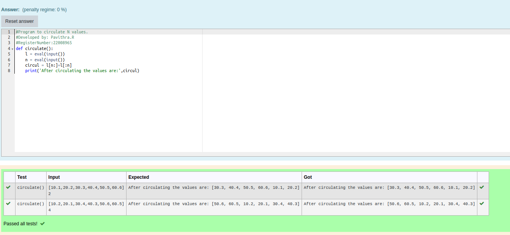

# Circulate-the-values-of-N-variables

## Aim:

To write a python program to circulate the n variables using function concept

## Equipment’s required:

PC
Anaconda - Python 3.7

## Algorithm: 

### Step 1: 
get n variable from the user

### Step 2: 
get the input

### Step 3: 
Get the value from the user for the number of rotation

### Step 4: 
Using the slicing concept rotate the list

### Step 5: 
print the values it would be interchanged

### Step 6: 
end the program

## Program:
```python
#Program to circulate N values.
#Developed by: Pavithra.R
#RegisterNumber:22008965
def circulate():
    l = eval(input())
    n = eval(input())
    circul = l[n:]+l[:n]
    print('After circulating the values are:',circul)
```

## Output:

## Result:
Thus the circulation of n variable successfully executed
